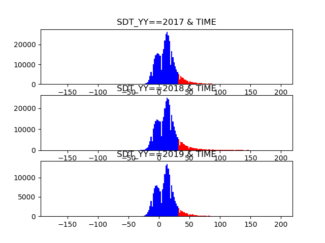

# 연도별 지연율

## 각 연도별 단순 지연율

| 데이터 | 지연율 |
| :--- | :--- |
| 2017 | 0.11997625228923903 |
| 2018 | 0.13340657952895119 |
| 2019 | 0.09484640092241803 |

## 출/도착별 연도별 지연율

## 실제/계획시각 차이에 대한 연도별 분포

빨간색\(31분\)부터 지연으로 확정된다.

## 현재까지의 해석/추론

1. 2019년도가 타 연도에 비해 지연율 및 시간 차이 분포의 빈도가 상대적으로 낮은 것을 확인할 수 있다. 현재 단순하게 생각할 수 있는 점은 해당 데이터는 2019년도 하반기 데이터를 가지고 있지 않다는 점. **즉, 각 연도별 상반기 및 하반기의 지연율 차이를 알아볼 필요가 있는 것 같다.**

